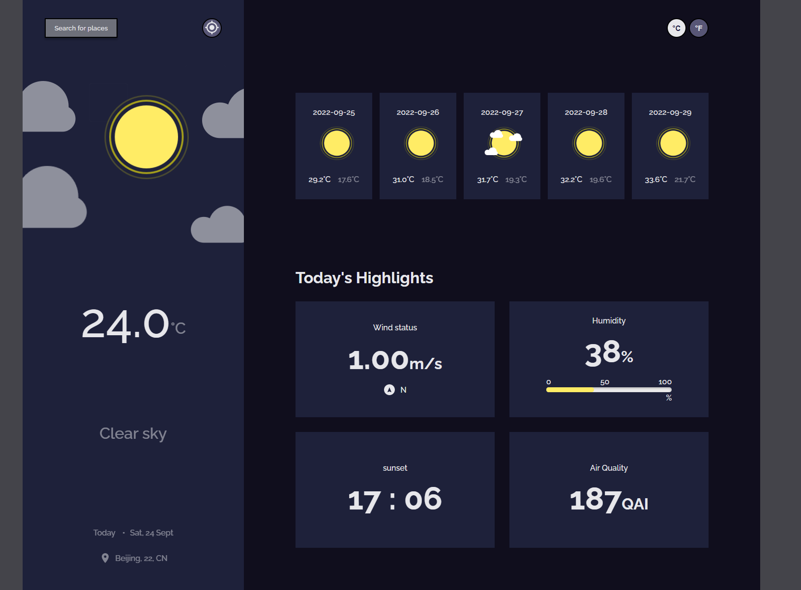

<!-- Please update value in the {}  -->

<h1 align="center">WeatherApp</h1>

<div align="center">
   Solution for a challenge from  <a href="http://devchallenges.io" target="_blank">Devchallenges.io</a>.
</div>

<div align="center">
  <h3>
    <a href="https://dev-challenge-lixin2014.vercel.app/">
      Demo
    </a>
    <span> | </span>
    <a href="https://github.com/LiXin2014/DevChallenge/tree/WeatherApp/WeatherApp">
      Solution
    </a>
    <span> | </span>
    <a href="https://devchallenges.io/challenges/mM1UIenRhK808W8qmLWv">
      Challenge
    </a>
  </h3>
</div>

<!-- TABLE OF CONTENTS -->

## Table of Contents

- [Overview](#overview)
  - [Built With](#built-with)
- [How to use](#how-to-use)
- [Contact](#contact)
- [Acknowledgements](#acknowledgements)

<!-- OVERVIEW -->

## Overview



This project uses API provided by https://www.weatherbit.io/. It provides below features:

You can search for city

You can see weather of today and the next 5 days

You can see the date and location of the weather

You can see according to image for each type of weather

You can see the min and max degree each day

You can see wind status and wind direction

You can see humidity percentage

You can see a visibility indicator

You can see the air pressure number

You can request my current location weather

You can convert temperature in Celcius to Fahrenheit and vice versa

### Built With

- [React](https://reactjs.org/)

## How To Use

<!-- Example: -->

To clone and run this application, you'll need [Git](https://git-scm.com) and [Node.js](https://nodejs.org/en/download/) (which comes with [npm](http://npmjs.com)) installed on your computer. From your command line:

```bash
# Clone this repository
$ git clone https://github.com/LiXin2014/DevChallenge.git

# Go into WeatherApp folder
$ cd WeatherApp

# Install dependencies
$ npm install

# Run the app in dev mode
$ npm run dev

# Build the app in production mode
$ npm run build
```

## Acknowledgements

<!-- This section should list any articles or add-ons/plugins that helps you to complete the project. This is optional but it will help you in the future. For example: -->

- [Adding Images in React](https://create-react-app.dev/docs/adding-images-fonts-and-files/)
- [Webpack file-loader](https://v4.webpack.js.org/loaders/file-loader/)
- [How to make html page has height of at least viewport and taller if content exceeds viewport height](https://makandracards.com/makandra/39473-stretching-an-html-page-to-full-height)
- [Style HTML5 progress element](https://css-tricks.com/html5-progress-element/)

## Contact

- GitHub [@LiXin2014](https://github.com/LiXin2014/)
